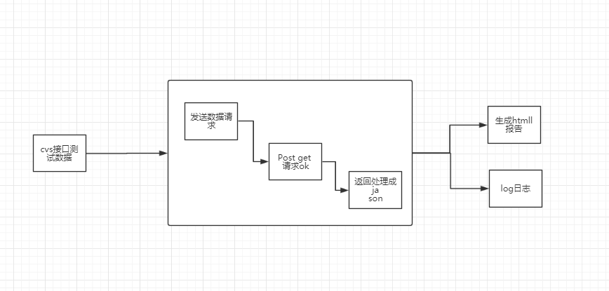

## 功能
能够对后台接口功能测试，通过CSV传入测试数据,抓取返回数据，并生产html报告。

## 依赖

pip install jinja2

pip install requests 

windows下
直接运行 install.bat 安装依赖

##有问题反馈
在使用中有任何问题，欢迎反馈给我，可以用以下联系方式跟我交流

* 邮件(chenjiejiji#gmail.com, 把#换成@)
* QQ: 539901741
* 作者:bob_jie

##结构
  -data                 --ReadCSV.py（csv数据处理）
                        --reqite.csv
  -libs                 --LibRequests.py（接口请求处理）
  -Log（日志存放地址）  --log日志
  -report（html报告）   --report（html报告存放地址） ---20170727153229.html（html报告）
  												 	                         ---collapse.png 
                                                     ---expand.png
  						--CreateHtml.py（生产HTML）
  						--HTML.html

  -Control.py （控制器）

##启动
windows启动方式
  starttest.bat